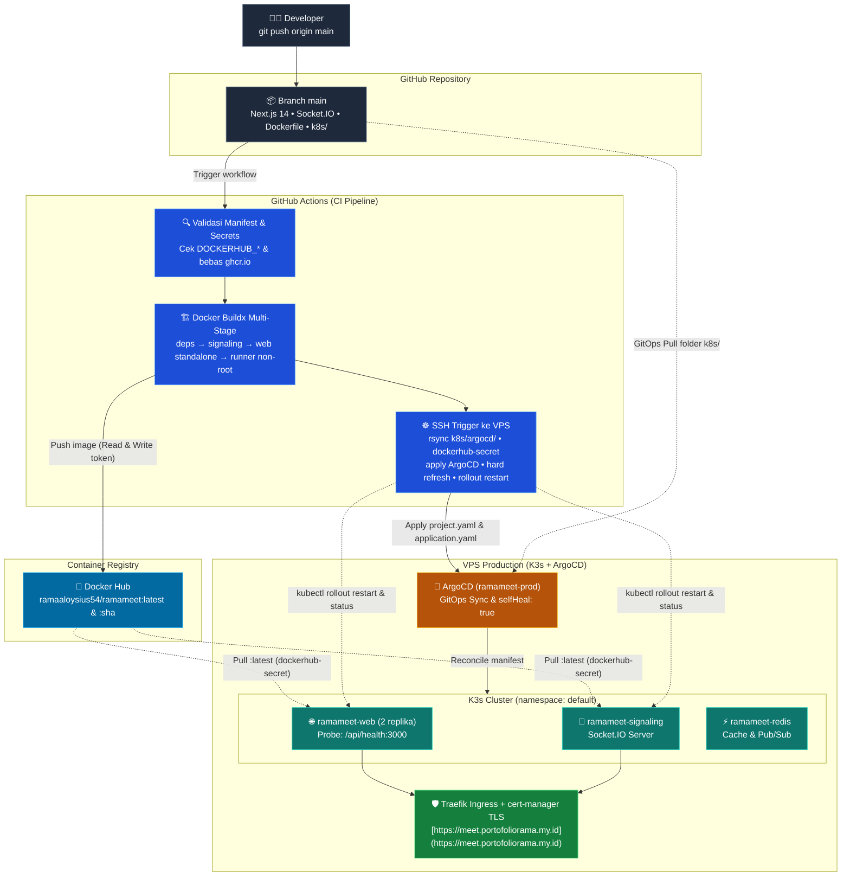

## Arsitektur CI/CD & GitOps (RamaMeet)

```mermaid
flowchart TD
    Dev["👨‍💻 Developer<br/>git push origin main"] --> GH

    subgraph Source["GitHub Repository"]
        GH["📦 Branch main<br/>Next.js 14 • Socket.IO • Dockerfile • k8s/"]
    end

    subgraph CI["GitHub Actions (CI Pipeline)"]
        V["🔍 Validasi Manifest & Secrets<br/>Cek DOCKERHUB_* & bebas ghcr.io"]
        B["🏗️ Docker Buildx Multi-Stage<br/>deps → signaling → web standalone → runner non-root"]
        SSH["☸️ SSH Trigger ke VPS<br/>rsync k8s/argocd/ • dockerhub-secret<br/>apply ArgoCD • hard refresh • rollout restart"]
        V --> B --> SSH
    end

    subgraph Registry["Container Registry"]
        DH["🐳 Docker Hub<br/>ramaaloysius54/ramameet:latest & :sha"]
    end

    subgraph VPS["VPS Production (K3s + ArgoCD)"]
        Argo["🔄 ArgoCD (ramameet-prod)<br/>GitOps Sync & selfHeal: true"]
        subgraph K3s["K3s Cluster (namespace: default)"]
            Web["🌐 ramameet-web (2 replika)<br/>Probe: /api/health:3000"]
            Sig["📡 ramameet-signaling<br/>Socket.IO Server"]
            Red["⚡ ramameet-redis<br/>Cache & Pub/Sub"]
        end
        Traefik["🛡️ Traefik Ingress + cert-manager TLS<br/>[https://meet.portofoliorama.my.id](https://meet.portofoliorama.my.id)"]
    end

    GH -->|"Trigger workflow"| V
    B -->|"Push image (Read & Write token)"| DH
    SSH -->|"Apply project.yaml & application.yaml"| Argo
    GH -.->|"GitOps Pull folder k8s/"| Argo
    Argo -->|"Reconcile manifest"| K3s
    DH -.->|"Pull :latest (dockerhub-secret)"| Web
    DH -.->|"Pull :latest (dockerhub-secret)"| Sig
    SSH -.->|"kubectl rollout restart & status"| Web
    SSH -.->|"kubectl rollout restart & status"| Sig
    Web --> Traefik
    Sig --> Traefik

    classDef source fill:#1e293b,stroke:#64748b,color:#f8fafc
    classDef ci fill:#1d4ed8,stroke:#60a5fa,color:#ffffff
    classDef registry fill:#0369a1,stroke:#38bdf8,color:#ffffff
    classDef gitops fill:#b45309,stroke:#fbbf24,color:#ffffff
    classDef runtime fill:#0f766e,stroke:#2dd4bf,color:#ffffff
    classDef prod fill:#15803d,stroke:#4ade80,color:#ffffff

    class Dev,GH source
    class V,B,SSH ci
    class DH registry
    class Argo gitops
    class Web,Sig,Red runtime
    class Traefik prod
```
